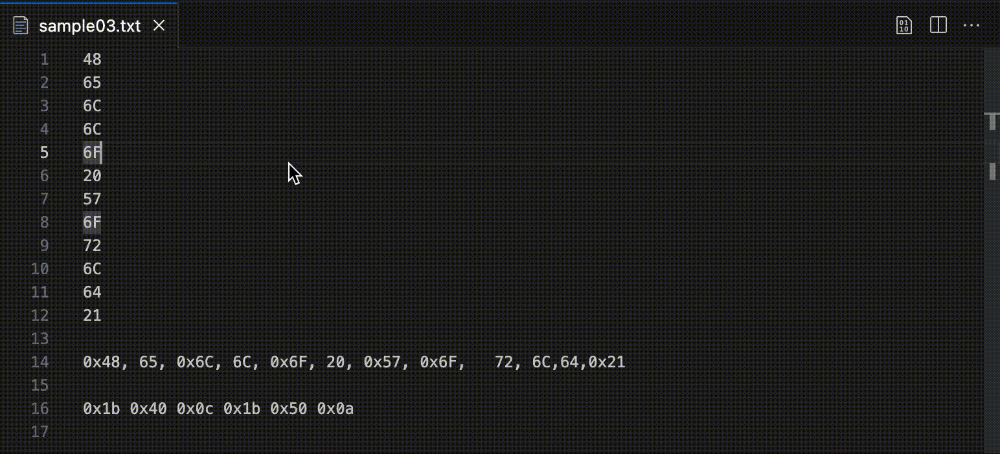
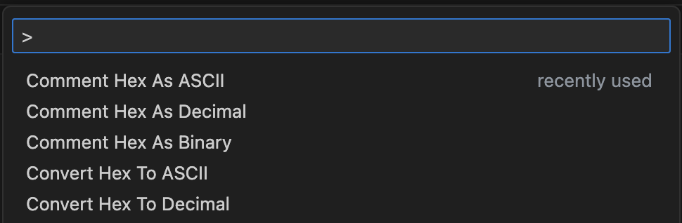

# Hex Multi-Converter

[GitHub Repository](https://github.com/jesperjohansson/vscode-hex-multi-converter)

## Features

- Hex to decimal conversion
- Hex to ASCII conversion
- Hex to binary conversion
- Multi-select support
- Replace selected text or insert conversion as comments

## Usage

1. Select the text you want to convert
2. Open command palette _(Shift + Command + P (Mac) / Ctrl + Shift + P (Windows/Linux))_
3. Search "convert" or "comment" and select conversion method

## Extension Settings

This extension contributes the following settings:

- `hex-multi-converter.convertEscapeCharactersToText`: Set to `false` to disable escape characters to text conversion (render newline instead of "\n" for example).
- `hex-multi-converter.convertControlCharactersToText`: Set to `false` to disable control characters to text conversion (show the ESC symbol instead of "ESC" for example).

<!-- ## Known Issues

Calling out known issues can help limit users opening duplicate issues against your extension. -->
