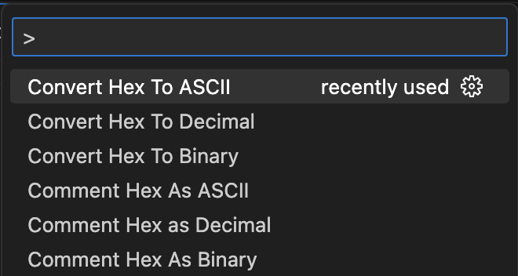
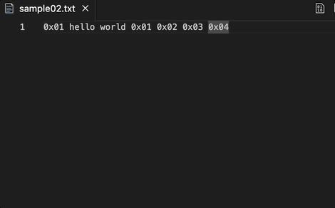
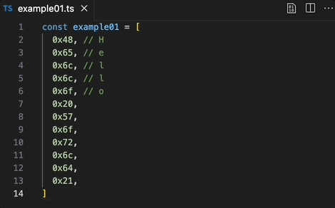
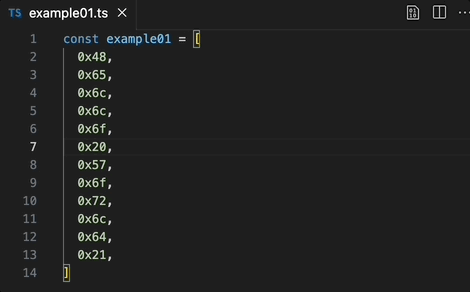
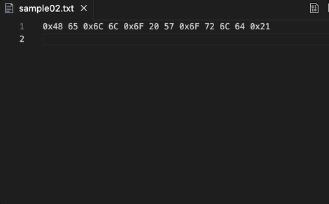

# Hex Multi-Converter

[GitHub Repository](https://github.com/jesperjohansson/vscode-hex-multi-converter)

## Features

- Hex to decimal conversion
- Hex to ASCII conversion
- Hex to binary conversion
- Multi-select support
- Replace selected text or insert conversion as comments

## Usage

1. Select the text you want to convert
2. Open command palette _(Shift + Command + P (Mac) / Ctrl + Shift + P (Windows/Linux))_
3. Search "convert" or "comment" and select conversion method

    

<!-- ## Extension Settings

Include if your extension adds any VS Code settings through the `contributes.configuration` extension point.

For example:

This extension contributes the following settings:

- `myExtension.enable`: Enable/disable this extension.
- `myExtension.thing`: Set to `blah` to do something.

## Known Issues

Calling out known issues can help limit users opening duplicate issues against your extension. -->
